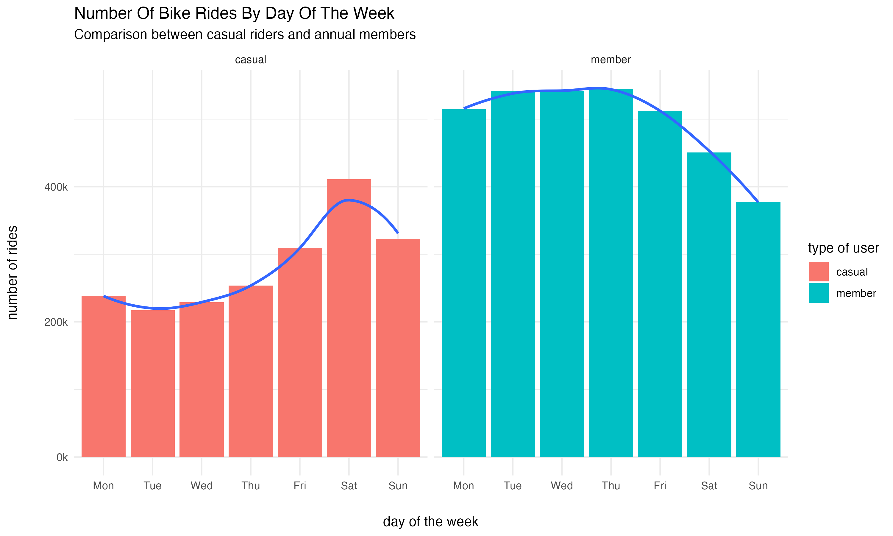
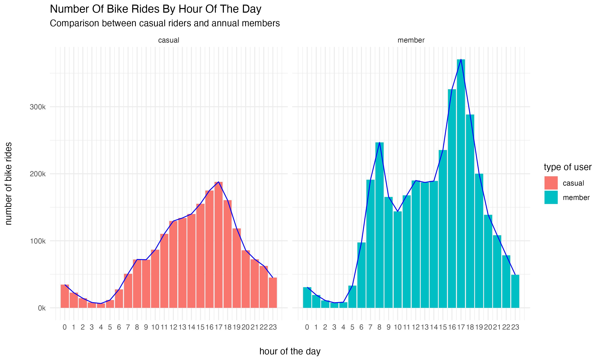
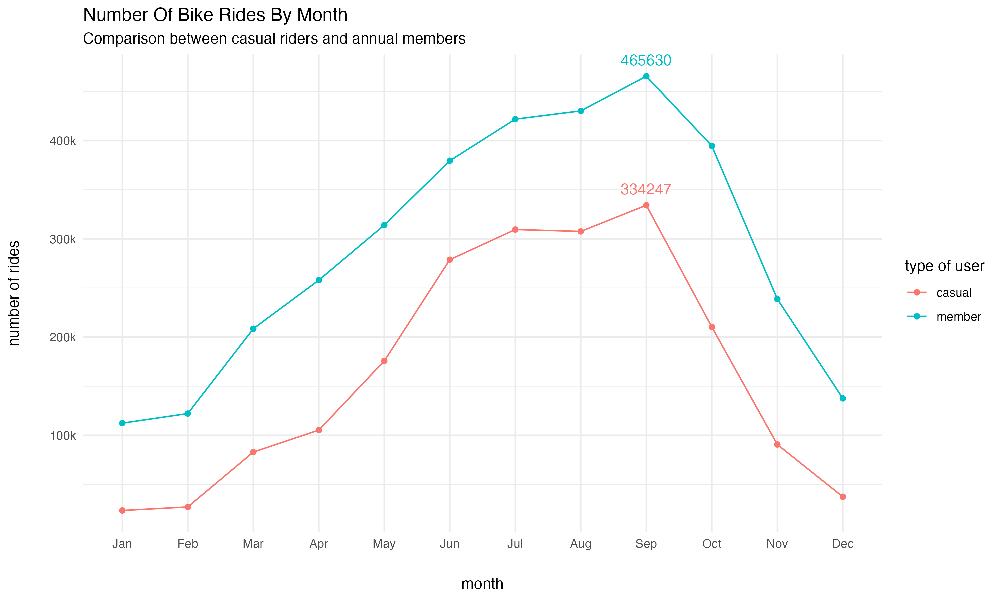
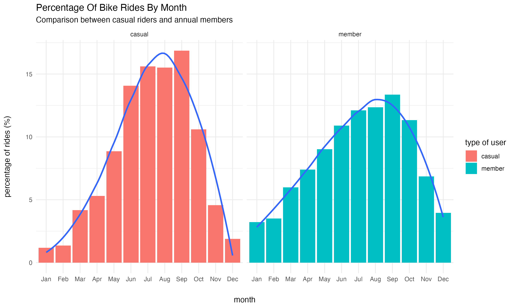
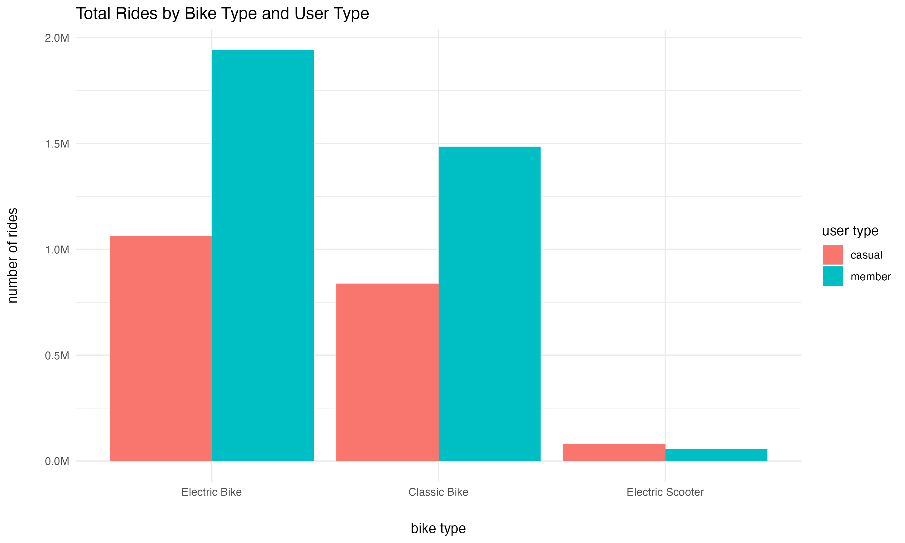

  
<br><br>

# Cyclistic Final Report <br><br>

### Table of Content  

<br>

- [Analysis Phase: Ask](#analysis-phase-ask)

- [Analysis Phase: Prepare](#analysis-phase-prepare)

- [Analysis Phase: Process](#analysis-phase-process)

- [Analysis Phase: Analyze and Share](#analysis-phase-analyze-and-share)

- [Analysis Phase: Act](#analysis-phase-act)

- [Appendix](#appendix)

### Analysis Phase: Ask  <br><br>


<span style="font-size:17px; font-weight:500">Business task:  </span><span style="font-size:16px">To understand the difference in usage behavior within two groups (casual riders and annual members), in order to obtain actionable insights to target marketing campaigns and increase the conversion of casual riders into annual members.</span>
<br><br>


### Analysis Phase: Prepare

<br>


#### Data source: 
<br>

* **Dataset:** Divvy/Bikeshare Public Bike-Share Dataset  (<https://divvy-tripdata.s3.amazonaws.com/index.html>)   


* **Format:** `.csv`   


* **Date Range:** July 2024 - Jun 2025  


* **Provider:** Lift Bikes and Scooters / Divvy (City of Chicago) - Public data  

<br>

#### Data Integrity Validation:
<br>

* 12 `.csv` files where downloaded to complete one year worth of data. The files selected were the most up-to-date files available by the time this report was made.  

* Data Validation Process was made using R as programming language and RStudio Desktop.  

* Each file was loaded as a data frame using the `read_csv()` function from the `dplyr` package.  

* Schema of each file was verified using  `str()`, `head()`, `colnames()`, and `glimpse()` functions to ensure consistency across datasets (column names, data types, order of columns).  

* A master data frame was created by joining all 12 data frames using `bind_rows()` function.  

* No duplicated or _NA_ values were found in the 'ride_id' column.  

* No rows with _NA_ values were found in the 'member_casual', 'started_at' and 'ended_at' columns.  

* _NA_ values for the station name or station Id were not filtered out, since it won't affect the analysis in this case.  

* Additional validations confirmed that all rides had logical time sequences (no negative durations or started_at > ended_at).

<br>

### Analysis Phase: Process  

<br>

<span style="font-size:18px; font-weight:500">Tool Used: </span> Programming language "R" and RStudio Desktop.
<br><br>

#### Process:  

<br>

The following columns were added and added to the main data frame to better organize, analyze and visualize the data: 


* **trip_duration** : this column represents the duration in minutes for each bike ride.   

`bike_df <- bike_df %>% mutate(trip_duration = round(as.numeric(difftime(ended_at, started_at, "mins")), digits = 2))` 

* **month** : shows the abbreviated month name.   

`bike_df <- bike_df %>% mutate(month = month(started_at,label = TRUE))` 

* **day_of_week** : shows the abbreviated day of the week.   

`bike_df <- bike_df %>% mutate(day_of_week = wday(started_at,label = TRUE))`  

* **type_of_day** : indicates whether the ride took place during a weekend day or a weekday.

`bike_df <- bike_df %>% mutate(type_of_day = ifelse(bike_df$day_of_week %in% c("Sat", "Sun"), "weekend", "weekday"))`  


Bike rides with duration times lower than 1 minute or greater than 1440 minutes (24hs) were considered outliers and were removed from the dataset.

`bike_df <- bike_df[!bike_df$trip_duration < 1 & !bike_df$trip_duration > 1440, ]`

  
<br> 

### Analysis Phase: Analyze and Share

<br>

#### Tool Used:

Programming language "R" and RStudio Desktop for analysis and data visualizations. <br><br>

#### Main differences in usage behavior between Annual Members and Casual riders found during the analysis: 

<br>

1. **Number of trips and average duration**  

* Annual members used the bikes ~75% more than casual riders during the year (bike rides: 3.48 millions vs 1,98 millions).  

* The average trip duration was 12.0 minutes for Annual Members and 20.6 minutes for Casual riders, showing that casual riders take longer trips.

2. **Usage by day of the week**

* Casual riders show a peak during the weekend (Saturday) and a more pronounced decline on midweek. This pattern suggest that casual rides are tied to free time or leisure.

* Annual members show a bigger and more consistent use of the bikes during the week days (76% of weekday rides), with a peak on midweek (Thursday and Wednesday) and declining on weekends. This pattern can be associated with a routine commuting behavior.  <br><br><br> 





3. **Usage by hour of the day**   

* Casual riders exhibit a gradual increase throughout the day, reaching their highest usage around 5 PM, suggesting more leisure-oriented or flexible travel patterns. 

* In contrast, annual members show two clear usage peaks: one around 7–8 AM and another between 4–5 PM, which aligns with typical commuting hours. This supports the idea that they use the service primarily for work-related travel.<br><br><br>




4. **Seasonal use of the bikes**   

* Annual member's peak: September (465K) and August (430K).  

* Casual rider's peak: September (334K) and July (309K).   

* Both annual members and casual riders tend to ride more in the summer, but annual members continue using the service more consistently during the colder months. This pattern indicates that annual members rely on bike sharing as part of their regular routine, while casual riders are more influenced by seasonal weather conditions.<br><br><br>

 <br><br><br> 


5. **Bike type preferences** 

The analysis shows a clear preference for electric bikes among both annual members and casual riders:

* Casual riders:  

Electric bikes: 1,063,221 rides (53.6%) | Classic bikes: 837,839 rides (42.3%) | Electric scooters: 81,460 rides (4.1%)

* Annual members:

Electric bikes: 1,941,637 rides (55.7%) | Classic bikes: 1,485,497 rides (42.6%) | Electric scooters: 56,142 rides (1.6%)

<br>

These results reveal the following key patterns:

- Electric bikes are the most used vehicle type for both user groups, slightly more among members. This suggests that ease of use, reduced physical effort, and greater speed make them attractive for both commuting and leisure purposes.

- Classic bikes are the second most used vehicle type, with consistent usage among both casual riders and members.

- Electric scooters are used more often by casual riders, although they represent a small share of overall trips. This could reflect more spontaneous or tourist-oriented usage rather than daily commuting habits.

<br>




<br><br>


### Analysis Phase: Act

<br><br>


#### Top 3 Recommendations

<br>

Based on the analysis conducted on usage patterns between casual riders and annual members, the following recommendations are proposed to help Cyclistic increase the conversion rate of casual riders into annual members:

1. **Launch targeted marketing campaigns during weekends and summer months**  
Casual riders show a significant increase in usage during weekends and warm-weather months (especially July to September). Cyclistic should take advantage of this seasonal behavior by launching promotional campaigns during these high-traffic periods. For example, offering summer discounts or free trials for annual memberships could attract casual users when their engagement is highest.

2. **Highlight cost savings and convenience for daily commuting**  
Annual members demonstrate a clear commuting pattern, with ride peaks during weekday mornings and evenings. Casual riders who use the service on weekdays or during rush hours can be specifically targeted with messaging that emphasizes the financial and time-saving benefits of becoming an annual member. Marketing materials should position the membership as a practical solution for everyday transportation.

3. **Introduce flexible or seasonal membership options**  
Since casual riders tend to use the service mainly for leisure and in specific seasons, offering more flexible membership plans could lower the barrier to entry. Cyclistic could experiment with summer-only memberships, weekend passes, or low-commitment monthly plans that auto-renew. These options would cater to casual riders’ needs and potentially ease them into committing to a full annual membership over time.

<br><br><b>

### Final Thoughts  


<br>

This analysis provided a clear understanding of how Cyclistic’s casual riders and annual members differ in their usage behavior. Casual riders tend to use the service on weekends and during warmer months, often for longer and more leisurely trips. In contrast, annual members ride more frequently, especially on weekdays and during commuting hours, showing patterns of routine use.

Electric bikes emerged as the most preferred vehicle type for both user groups, reinforcing the importance of maintaining and expanding this segment. Additionally, the consistent usage of classic bikes and the occasional use of scooters offer further insights into user preferences.

The findings support Cyclistic’s business objective by offering actionable, data-driven recommendations aimed at converting casual riders into loyal, long-term members. By aligning marketing strategies with user behavior—focusing on seasonality, commuting benefits, and flexible membership options—Cyclistic can increase membership rates and long-term engagement with the service.

<br><br><br><br>

### Acknowledgments  


This project was inspired in part by ojaswani16's work: https://github.com/ojaswani16/Cyclistic-bike-share-analysis

<br><br><br>


# Appendix {-}

### R Code: Data Preparation

```{r, echo=TRUE, eval=FALSE}
# Load monthly datasets
july <- read_csv('.../202407-divvy-tripdata.csv')
august <- read_csv('.../202408-divvy-tripdata.csv')
september <- read_csv('.../202409-divvy-tripdata.csv')
october <- read_csv('.../202410-divvy-tripdata.csv')
november <- read_csv('.../202411-divvy-tripdata.csv')
december <- read_csv('.../202412-divvy-tripdata.csv')
january <- read_csv('.../202501-divvy-tripdata.csv')
february <- read_csv('.../202502-divvy-tripdata.csv')
march <- read_csv('.../202503-divvy-tripdata.csv')
april <- read_csv('.../202504-divvy-tripdata.csv')
may <- read_csv('.../202505-divvy-tripdata.csv')
june <- read_csv('.../202506-divvy-tripdata.csv')

# Combine all datasets
bike_df <- bind_rows(july, august, september, october, november, december,
                     january, february, march, april, may, june)

# Create trip duration column
bike_df <- bike_df %>% 
  mutate(trip_duration = round(as.numeric(difftime(ended_at, started_at, "mins")), 2))

# Create additional time-based variables
bike_df <- bike_df %>% 
  mutate(
    month = month(started_at, label = TRUE),
    day_of_week = wday(started_at, label = TRUE, week_start = 1),
    type_of_day = ifelse(day_of_week %in% c("Sat", "Sun"), "weekend", "weekday")
  )

# Filter out trips <1 min or >24 hours
bike_df <- bike_df %>% 
  filter(trip_duration >= 1, trip_duration <= 1440)

# Backup copy
df_original <- bike_df
```

### R Code: Analysis Summary Queries  

```{r, echo=TRUE, eval=FALSE}
# Ride count by user type
count(bike_df, member_casual)

# Average trip duration by user type
bike_df %>%
  group_by(member_casual) %>%
  summarize(avg_trip_duration = mean(trip_duration))

# Weekend vs weekday ride count
bike_df %>%
  group_by(member_casual, type_of_day) %>%
  summarize(n_rides = n())

# Average trip duration by day of week and user type
bike_df %>%
  group_by(member_casual, day_of_week) %>%
  summarize(avg_trip_duration = mean(trip_duration)) %>%
  arrange(desc(avg_trip_duration))

# Ride count by day of week
bike_df %>%
  group_by(member_casual, day_of_week) %>%
  summarize(number_of_trips = n()) %>%
  arrange(desc(number_of_trips))

# Monthly ride count by user type
bike_df %>%
  group_by(member_casual, month(started_at, label = TRUE)) %>%
  summarize(number_of_trips = n()) %>%
  arrange(member_casual, number_of_trips)

# Monthly ride percentages
bike_df %>%
  group_by(member_casual, month(started_at, label = TRUE)) %>%
  summarize(number_of_trips = n()) %>%
  left_join(
    bike_df %>%
      group_by(member_casual) %>%
      summarize(trips_by_client = n()),
    by = "member_casual"
  ) %>%
  mutate(percentage_of_total = (number_of_trips / trips_by_client) * 100) %>%
  arrange(member_casual, percentage_of_total)

# Rides longer than 30 minutes
bike_df %>%
  filter(trip_duration >= 30) %>%
  group_by(member_casual, type_of_day) %>%
  summarize(total = n())

bike_df %>%
  filter(trip_duration >= 30) %>%
  group_by(member_casual, day_of_week) %>%
  summarize(total = n()) %>%
  arrange(total)

#type of bike preferred by user

bike_df %>% group_by(member_casual, bike_type) %>% 
  summarize(type_of_bike = n()) %>%  
  arrange(member_casual, desc(type_of_bike))


